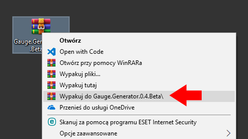
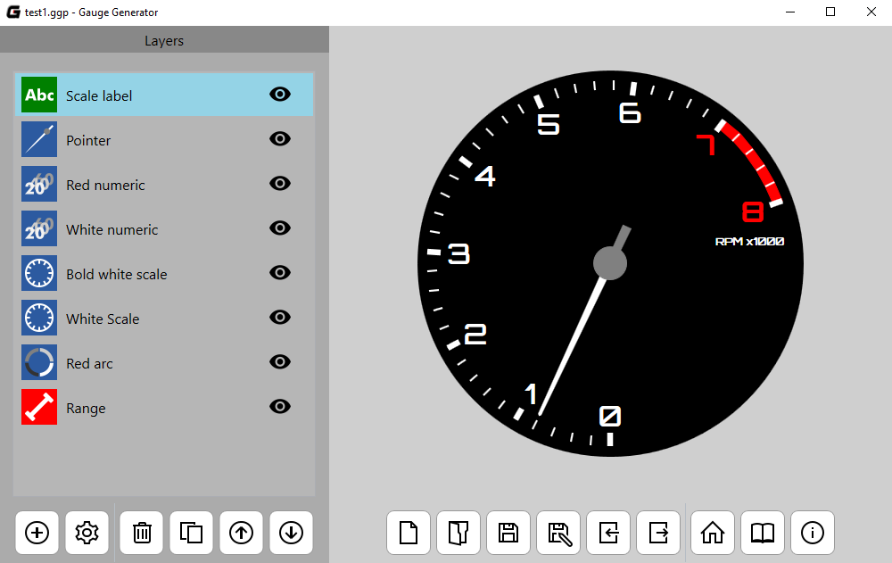
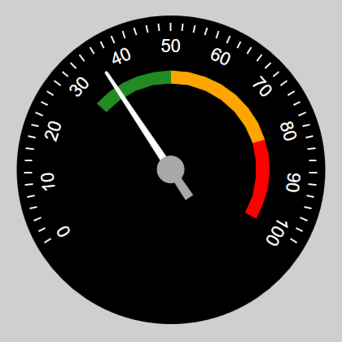

# Gauge-Generator

Gauge Generator is a free application which allows generate different types of analog clock face. Here is the full online documentation containing tips and examples of projects. Select the next page from menu on the left side of this website.

## Documentation

More information about the application, together with examples of work you can find [here](https://github.com/adan2013/Gauge-Generator).

## Instalation

1. Go to [releases page in GitHub](https://github.com/adan2013/Gauge-Generator/releases)
2. Download ZIP file of the newest version
 

3. Unzip downloaded file by using an application such as WinRAR or 7-Zip
 

4. Run the file with the `.exe` extension
 

## Screenshots

