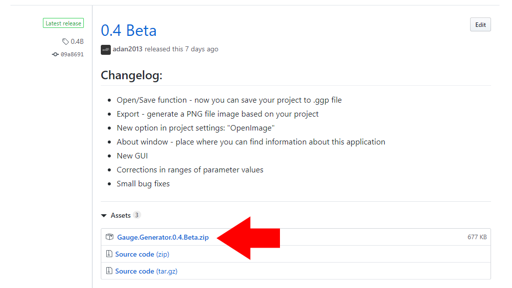
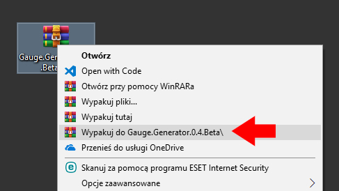
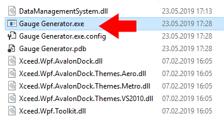

# Welcome to Gauge Generator

Gauge Generator it's a free application allowing generating different types of analog clock face. This is a full online documentation containing tips and examples of projects. Select the next page from menu on the left side of this website.

## Instalation

1. Go to [releases page in GitHub](https://github.com/adan2013/Gauge-Generator/releases)
2. Download ZIP file of the newest version
 

3. Unzip downloaded file by using an application such as WinRAR or 7-Zip
 

4. Run the file with the `.exe` extension
 
