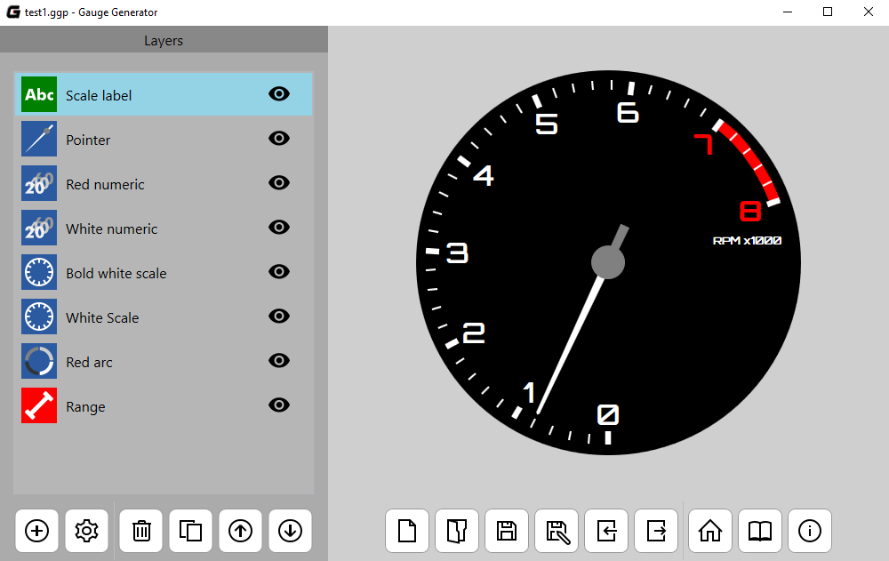
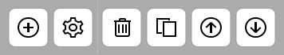
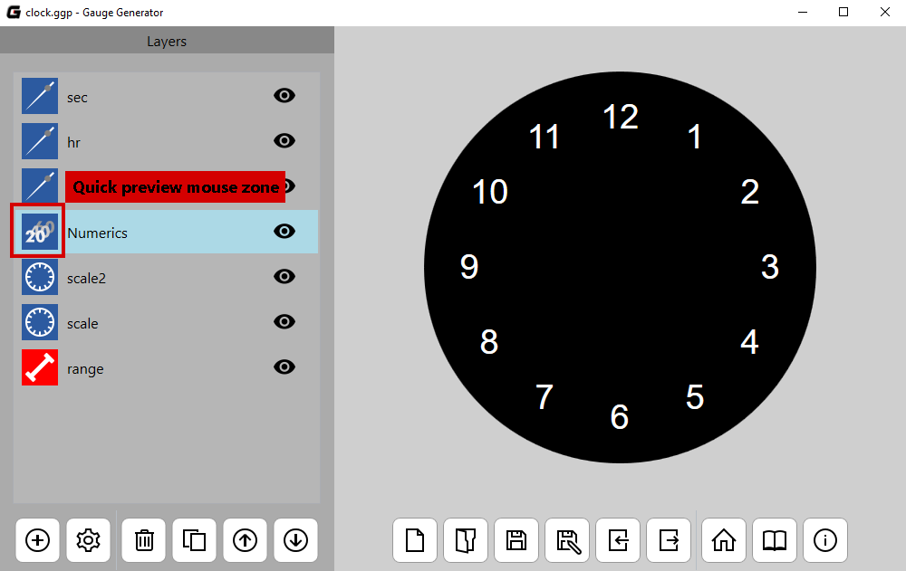
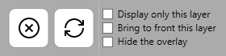
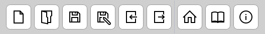
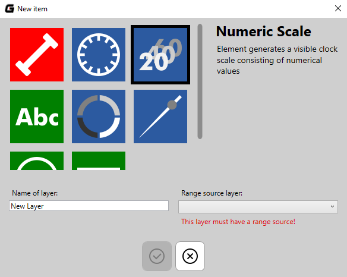
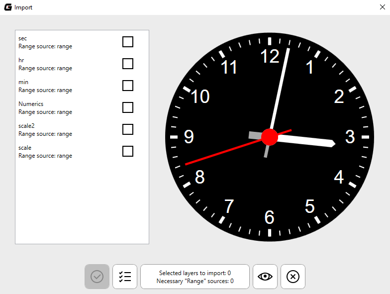
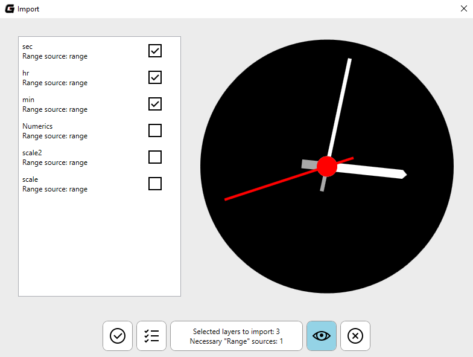

# Main interface

Main interface consists of two parts. A multifunctional sidebar is located on the left side. It contains a list of created objects in opened project or property editor (more information below). On the right side there is a live preview and number of buttons allowing manipulation of the project file.

## Sidebar

Sidebar can display a three different screens:

* The list of layers in project,
* Property layer editor,
* Project settings editor.

### Layers list

The default screen of sidebar is the list of layers. At the bottom of the screen are located the following buttons:

* **New layer** - opens a new item windows,
* **Project settings** - opens an editor of project settings,
* **Delete a layer** - deletes a selected value,
* **Clone a layer** - clones a selected value,
* **Move up/down** - changes the order of layers in the project.

Double-clicking on the item on the list of layers opens the property layer editor. Eye icons allows you to control the visibility of specific layers. Hovering the mouse cursor over the layer icon will allow you to quickly preview the layer - only it will be visible in the preview on the right side of application.

### Project editor

Clicking button with a gear opens the editor of the project settings. You can change here a color of background or clock face. You can also change the size of generated PNG image in export. To return to the previous screen use the button with the X letter.

### Layer editor

After creating a new layer sidebar opens the property editor. Editor allows you to adjust parameters to your needs. At the bottom of the screen are located: the reset button and the list of preview modificators:

* **Display only this layer** - hides all layers except the edited layer,
* **Bring to front this layer** - displays the edited layer at the top of the project,
* **Hide the overlay** - hides a pulsing graphic overlay visible on the preview.

## Live preview

A large part of right side of main window application consist a live preview. It reflects the current state of the list of layers with their visibility (eye button). Below is a bar with the following buttons:

* Open a new project,
* Open a project from file,
* Save changes in project,
* Save project to the new file,
* Import layers from another project,
* Export project to PNG image file,
* Open "Welcome screen",
* Open this documentation in a web browser,
* Show more information about this application.

# New item window

To create a new layer use the plus button below the list of layers. It opens the new item window and then:

1. Choose a layer type using list with colorful squares (short description of selected type shows on the right side of this window),
2. Give a name that describes layer's task,
3. Select a "Range Source" - the layer of "Range" type (more information on ["Layer types"](layers.md) page),
4. Click the OK button at bottom of the window.

# Import window

The import window allows you to move layers from the project file to the currently opened work. After selecting the file mark the interesting layers. Hovering over items immediately launches a quick view of each of them. There is no "Range" layers on the list. They will be automatically added to the project if they are required. You can see this by using the counter at the bottom of the window. Holding the button with the eye icon you can preview all the layers you marked.

# Welcome screen

After launching, the application opens the welcome screen. Here, you can create a new project, open an existing one from a file or select one from the "recent project" list. On the right you can use the sample works created by me or open one of the video tutorials.