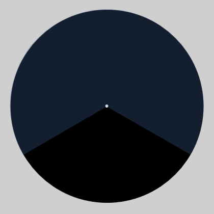
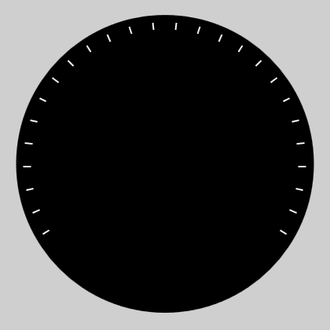
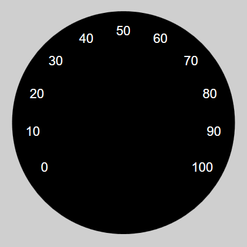
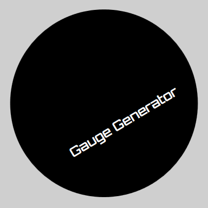
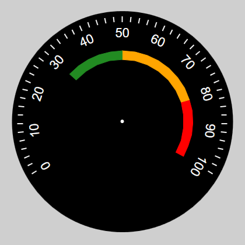
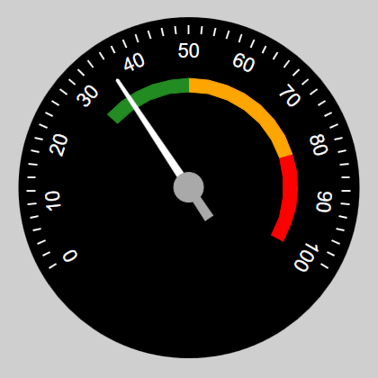

# Layer structure

The whole process of creating a clock face is based on layer mechanics well known from graphic programs, such as Gimp or Photoshop. In this application, there are many types of layers that add different objects to the project. By modifying properties and changing layers' order you can create a lot of complex clock faces.

# Percentage values

Numerical parameters in property editor are mostly based on percentages. It makes the sizes of the objects they describe are scaled to the size of the final raster graphics. For example:

* 50 in a circle radius property means 50% of the half width of the final graphic.
* -40 in an offset X property means shift to the left by 40% of the half width of the final graphics.

## Range

"Range" type is the most important object and MUST be added first to the project. It is used for define position and size of the clock face. In addition, its task is to determine the range of values that will be use by the clock which we create.

Why it must be defined first? While creating other types of layers, the application requires selection the range which the object belongs. The "Range" element is a common element connecting all layers belonging to one clock.

Parameters of the "Range" layer:

* **Circle position**
    * CircleCenter_X *<-100; 100>* - horizontal position of the clock face
    * CircleCenter_Y *<-100; 100>* - vertical position of the clock face
    * CircleRadius *<20; 100>* - radius of the clock face
 
* **Clock hands**
    * ClockHandsOffset_X *<-80; 80>* - horizontal offset of the clock hands hook
    * ClockHandsOffset_Y *<-80; 80>* - vertical offset of the clock hands hook
    * ClockHandsPointColor - color of the clock hands hook's dot
    * ClockHandsPointSize <1; 5> - size of the clock hands hook's dot
 
* **Range**
    * AngleStart *<0; 360>* - range start angle
    * OpeningAngle *<-360; 360>* - opening angle of range (negative value means counter-clockwise)
    * RangeEndValue *<-1000; 1000>* - the maximum value of the scale
    * RangeStartValue *<-1000; 1000>* - the  minimum value of the scale

## Linear Scale

Type "Linear Scale" is used for generate the radial lines on the basis of the range of values from "Range" layer. In parameters, you can specify the initial value, end value and scale step. The type also allows you to draw an arc on the whole range.

Parameters of the "Linear Scale" layer:

* **Lines**
    * DistanceFromCenter *<20; 95>* - distance between the center of the clock face and the end of lines
    * LineColor - color of the lines
    * LineLength *<2; 100>* - distance between the center of the clock face and the start of lines
    * LineThickness *<2; 5>* - line thickness
 
* **Range**
    * DrawArcOnEdge - draw arc connecting all lines
    * RangeMax *<-1000; 1000>* - the maximum value of the scale
    * RangeMin *<-1000; 1000>* - the  minimum value of the scale
    * RangeStep *<1; 1000>* - jump of values between the lines

## Numeric Scale

Type "Numeric Scale" is used for generate a numerical scale based on the range of values from "Range" layer. In parameters, you can specify the initial value, the end value and the scale step.

Parameters of the "Numeric Scale" layer:

* **Font**
    * Bold - font modifier: bold
    * FontColor - color of font
    * FontFamily - name of font family
    * FontSize *<5; 20>* - font size
    * Italic - font modifier: italic
    * Underline - font modifier: underline
 
* **Position**
    * DistanceFromCenter *<20; 100>* - distance between the center of the clock face and the labels
    * Rotated - tilt the labels to the center of the clock face
 
* **Range**
    * RangeMax *<-1000; 1000>* - the maximum value of the scale
    * RangeMin *<-1000; 1000>* - the minimum value of the scale
    * RangeStep *<1; 1000>* - jump of values between the labels
    * Rounding *<0; 2>* - number of leading zeros
    * ScaleMultiplier *<0.01; 100>* - scale multiplier that allows you to change values of the scale
    
## Label

"Label" type allows you to add a simple text label.

Parameters of the "Label" layer:

* **Font**
    * Bold - font modifier: bold
    * FontColor - color of font
    * FontFamily - name of font family
    * FontSize *<5; 20>* - font size
    * Italic - font modifier: italic
    * Text - displayed text
    * Underline - font modifier: underline
 
* **Position**
    * Angle *<-360; 360>* - rotation angle
    * Position_X *<-100; 100>* - horizontal offset of the label
    * Position_Y *<-100; 100>* - vertical offset of the label

## Arc

"Arc" type allows you to add the arc which can be used for check dangerous ranges of values. You can do it manually by giving the absolute angle or value from "Range" layer.

Parameters of the "Arc" layer:

* **Arc**
    * Color - color of the arc
    * ManualAngle - range switch (false - range min/max; true - manual angle)
    * Weight *<1; 100>* - arc thickness
 
* **Position**
    * CircleOffset_X *<-100; 100>* - horizontal offset
    * CircleOffset_Y *<-100; 100>* - vertical offset
    * DistanceFromCenter *<20; 100>* - arc radius
 
* **Range**
    * AngleStart *<0; 360>* - start angle
    * OpeningAngle *<-360; 360>* - opening angle
    * RangeMax *<-1000; 1000>* - end value of "Range" scale
    * RangeMin *<-1000; 1000>* - start value of "Range" scale

## Clock Hand

"Clock Hand" type adds a clock hand to the project.

Parameters of the "Clock hand" layer:

* **Beginning of clock hand**
    * N_Color - color of negative part of the clock hand
    * N_Length *<0; 50>* - length of negative part of the clock hand
    * Thickness *<1; 10>* - clock hand thickness
 
* **Circle**
    * CircleBehindTheArrow - circle above or below the the clock hand
    * CircleColor - color of center circle
    * CircleSize *<1, 10>* - size of center circle
 
* **End of clock hand**
    * EndType - type of arrow
    * P_Color - color of positive part of the clock hand
    * P_Length *<20; 100>* - length of positive part of the clock hand
 
* **Range**
    * Angle *<0; 360>* - manual clock hand angle
    * ManualAngle - range switch (false - value; true - angle)
    * Value *<-1000; 1000>* - selected value from range source

The appearance of individual types of the clock hands (EndType parameter):

galeria galeria galeria galeria galeria